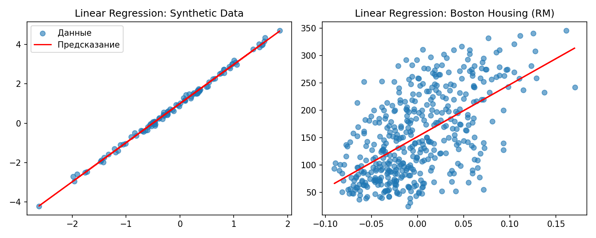
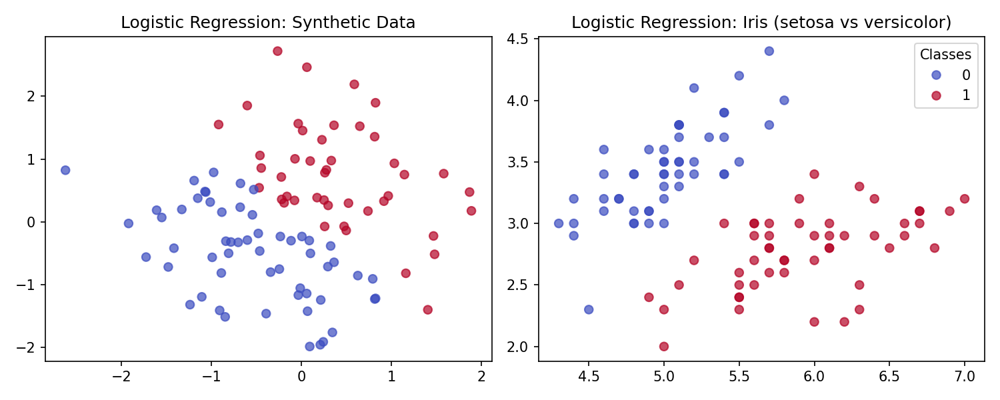

# Regressions — Linear & Logistic Regression from Scratch

Реализация линейной и логистической регрессии **на чистом NumPy** — без `sklearn`, `TensorFlow` или `PyTorch`.  
Проект создан для глубокого понимания фундаментальных алгоритмов машинного обучения.




---

## ✨ Фичи

- **Градиентный спуск** с поддержкой ранней остановки
- **Нормализация данных**: Z-score и Min-Max
- **L2-регуляризация** (Ridge) для борьбы с переобучением
- **Сохранение и загрузка моделей** в `.npz` формате
- **Полностью векторизованная реализация** (без циклов `for`)
- **Unit-тесты** с покрытием основных сценариев (8/8 ✅)
- **Сравнение с `sklearn`** — веса и предсказания совпадают

---

## 📦 Установка

Клонируй репозиторий и установи в режиме разработки:

```bash
git clone https://github.com/your-username/regressions.git
cd regressions
pip install -e .# regressions
